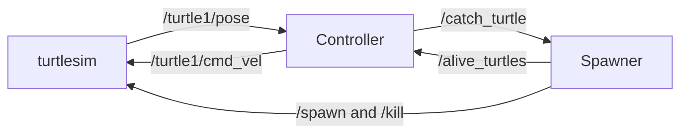

# Turtle Catcher

**Turtle Catcher** is a ROS 2 game built with `turtlesim`. It combines autonomous pursuit with a terminal-controlled memory challenge: turtles appear at random positions, and the catcher must remove them according to the rules of the selected mode.

## Game modes

### Autonomous pursuit

The controller selects a target, steers `turtle1` toward it, and requests a catch when it is within range. By default, it always chooses the closest live target.

### Manual memory game

The player drives `turtle1` from the terminal. Targets are hidden from the terminal, and the player must catch the oldest currently live turtle first. Catching a newer turtle ends the round. The terminal reports the score and offers a `y/n` replay prompt.

## Requirements

- Ubuntu with ROS 2 Jazzy
- `turtlesim`
- `colcon`
- `rosdep`
- The ROS 2 package providing `service_msgs`

## Build

From the workspace root:

```bash
source /opt/ros/jazzy/setup.bash
rosdep install --from-paths src --ignore-src -r -y
colcon build --symlink-install
source install/setup.bash
```

## Run

Run one mode at a time. Both modes use the same `turtle1`, topics, and services.

### Autonomous mode

```bash
source /opt/ros/jazzy/setup.bash
source install/setup.bash
ros2 launch my_bringup turtlesim_catch_them_all.launch.xml
```

This starts `turtlesim_node`, `controller`, and `spawner`.

### Manual memory mode

Run this from an interactive terminal and keep that terminal focused:

```bash
source /opt/ros/jazzy/setup.bash
source install/setup.bash
ros2 launch my_bringup manual_catch_them_all.launch.xml
```

Controls:

| Key | Action |
| --- | --- |
| `W` | Move forward |
| `S` | Move backward |
| `A` | Turn left |
| `D` | Turn right |
| `W` + `A/D` | Move along a curve |
| `Space` | Stop immediately |
| `Q` | End the current round |

Movement expires automatically after `key_hold_timeout` seconds without another key event. This is the portable terminal equivalent of releasing a key. After a round ends, enter `y` to clear the board and replay, or `n` to exit.

## How it works



### Spawner

`spawner` creates turtles at random positions in the `0.0` to `11.0` arena range. It assigns names using an incrementing counter, keeps the live-target list in memory, and publishes that list after successful spawns and removals.

### Autonomous controller

`controller` uses the catcher pose and the live-target list to calculate proportional linear and angular velocity. It disables the catcher pen and catches a target when the distance is at most `0.5` turtlesim units. A catch request remains guarded until the target disappears from the live-target list, preventing duplicate asynchronous removal requests.

### Manual controller

`manual_controller` reads keyboard input from the controlling terminal and publishes velocity commands. Linear and angular input are independent, so forward motion can be combined with turning. It treats the first item in the live-target array as the oldest target, tracks score, ends invalid rounds, clears the board for replay, and teleports the catcher back to the arena center.

## Configuration

All game parameters are defined in [catch_them_all_config.yaml](src/my_bringup/config/catch_them_all_config.yaml).

```yaml
/turtle_controller:
  ros__parameters:
    catch_closest_turtle_first: True
    max_linear_speed: 9.0

/manual_controller:
  ros__parameters:
    manual_linear_speed: 5.0
    manual_angular_speed: 2.5
    catch_distance: 0.5
    key_hold_timeout: 0.6

/turtle_spawner:
  ros__parameters:
    turtle_name_prefix: "my_turtle"
    spawn_frequency: 1.5
    max_alive_turtles: 5
```

| Parameter | Node | Meaning |
| --- | --- | --- |
| `catch_closest_turtle_first` | `controller` | Select the nearest target when true; otherwise select the first target |
| `max_linear_speed` | `controller` | Maximum autonomous forward speed |
| `manual_linear_speed` | `manual_controller` | Manual forward and reverse speed |
| `manual_angular_speed` | `manual_controller` | Manual turning speed |
| `catch_distance` | `manual_controller` | Distance at which manual contact counts as a catch |
| `key_hold_timeout` | `manual_controller` | Time before stale keyboard input stops movement |
| `turtle_name_prefix` | `spawner` | Prefix used for generated target names |
| `spawn_frequency` | `spawner` | Target spawn rate in turtles per second |
| `max_alive_turtles` | `spawner` | Maximum number of live targets |

The launch files load this same configuration and apply only the parameters matching each node. Manual launch also disables spawner and turtlesim console messages that would reveal the target sequence.

## ROS 2 interfaces

### Topics

| Name | Type | Direction | Purpose |
| --- | --- | --- | --- |
| `/turtle1/cmd_vel` | `geometry_msgs/msg/Twist` | Controllers publish | Catcher velocity commands |
| `/turtle1/pose` | `turtlesim/msg/Pose` | Controllers subscribe | Catcher pose |
| `/alive_turtles` | `my_interfaces/msg/TurtleArray` | Spawner publishes | Ordered live-target list |

### Services

| Name | Type | Used by | Purpose |
| --- | --- | --- | --- |
| `/catch_turtle` | `my_interfaces/srv/CatchTurtle` | Controllers | Request removal of a named target |
| `/spawn` | `turtlesim/srv/Spawn` | Spawner | Create targets |
| `/kill` | `turtlesim/srv/Kill` | Spawner | Remove caught targets |
| `/turtle1/set_pen` | `turtlesim/srv/SetPen` | Controllers | Disable the catcher trail |
| `/turtle1/teleport_absolute` | `turtlesim/srv/TeleportAbsolute` | Manual controller | Reset the catcher for replay |

### Custom interfaces

`my_interfaces/srv/CatchTurtle`:

```text
string name
---
bool success
```

`my_interfaces/msg/Turtle`:

```text
string name
float64 x
float64 y
float64 theta
```

`my_interfaces/msg/TurtleArray`:

```text
Turtle[] turtles
```

## Tests

Run the Python package checks with:

```bash
colcon test --packages-select turtlesim_catch_them_all
colcon test-result --verbose
```

The package runs `flake8` and `pep257` checks.

## Limitations

- The manual score exists only for the current process; there is no persistent leaderboard or high-score storage.
- There is no timer, lives system, or autonomous-mode score.
- Target turtles do not move after they spawn.
- Autonomous pursuit drives directly toward targets and does not perform obstacle avoidance or path planning.
- Keyboard release is approximated with `key_hold_timeout` because standard terminal input does not provide portable key-release events.
- Spawning is asynchronous, so a spawn attempt can be skipped if the turtlesim service is not ready.

## Project layout

```text
.
├── src/
│   ├── my_bringup/
│   │   ├── config/catch_them_all_config.yaml
│   │   └── launch/
│   │       ├── manual_catch_them_all.launch.xml
│   │       └── turtlesim_catch_them_all.launch.xml
│   ├── my_interfaces/
│   │   ├── CMakeLists.txt
│   │   ├── package.xml
│   │   └── src/
│   │       ├── CatchTurtle.srv
│   │       ├── Turtle.msg
│   │       └── TurtleArray.msg
│   └── turtlesim_catch_them_all/
│       ├── package.xml
│       ├── setup.py
│       └── turtlesim_catch_them_all/
│           ├── manual_controller.py
│           ├── turtle_controller.py
│           └── turtle_spawner.py
├── README.md
└── .gitignore
```

`build/`, `install/`, and `log/` are generated by `colcon` and are intentionally excluded from the source layout.
